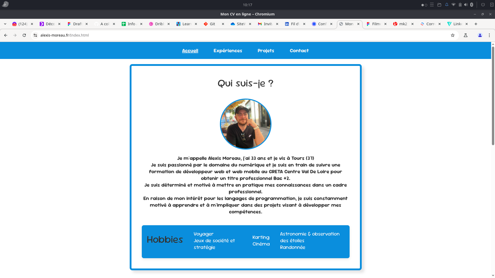

# Projet Site CV Version 2.0

Projet : Mon site CV – Développeur Web & Web Mobile
Dans le cadre de ma formation au GRETA Centre-Val de Loire pour devenir Développeur Web & Web Mobile, j’ai réalisé un site web CV afin de mettre en pratique les compétences acquises au début de la formation.

Ce projet m’a permis de consolider mes bases en HTML et CSS, tout en créant un support concret et professionnel pour présenter mon parcours.

  Le site met en avant :
   
   
  -Mon parcours de formation,

  -Mes compétences techniques,

  -Mes premiers projets,

  -Mes coordonnées pour faciliter la prise de contact.

Un projet formateur et motivant qui m’a permis de faire le lien entre apprentissage théorique et réalisation pratique.

 

Ouvrir en premier le fichier Index.html

## 🛠️Compérences :

## 🔗Liens :

